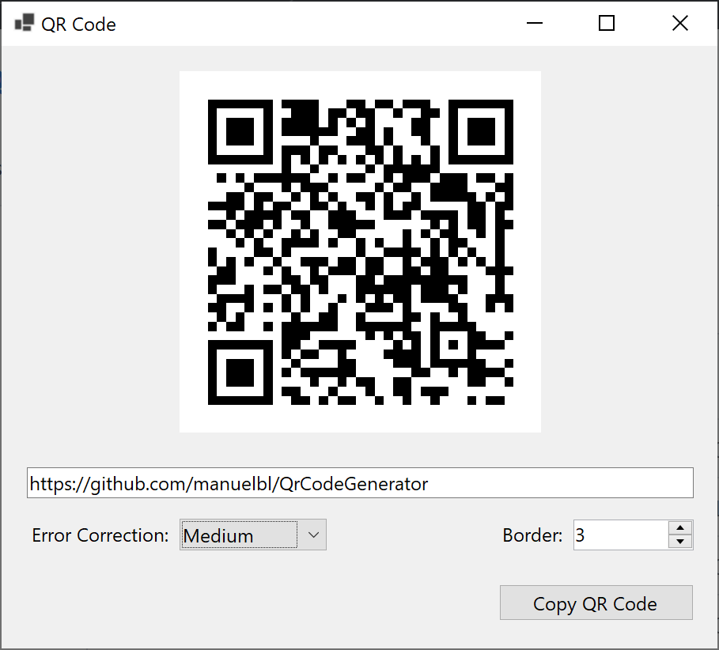

# Windows Forms example application

This example application shows how to use the QR code library in a Windows Forms application:

- `QrCodeControl` is a custom control that can be used in any `Form`.
- The control also implements copying the QR code to the clipboard.

