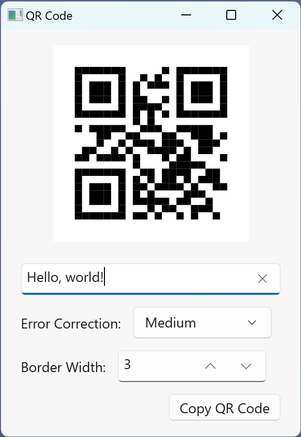

# WinUI 3 example application

This example application shows how to use the QR code library in a WinUI 3 application:

- [`QrCodeControl`](Demo-WinUI/QrCodeControl.xaml.cs) is a user control for displaying a QR code.
- [`QrCodeDrawing`](Demo-WinUI/QrCodeDrawing.cs) is a class for drawing a QR code to [Win2D](https://github.com/microsoft/Win2D) `CanvasDrawingSession` (resolution independent) or to a PNG file.
- Copying a QR code to the clipboard is also shown.

